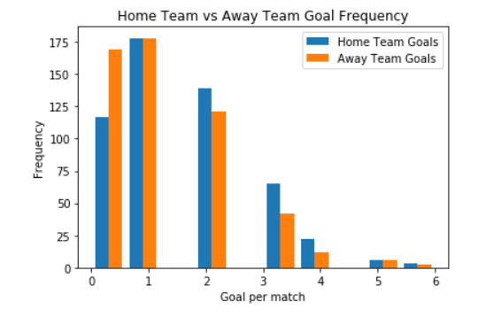
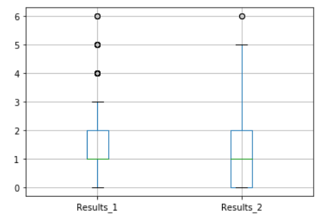
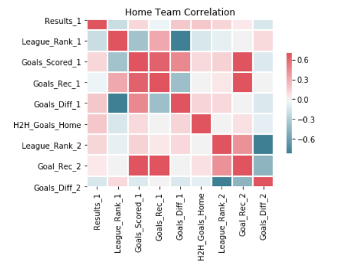
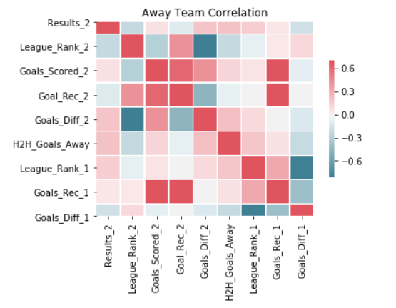
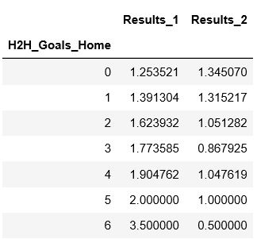
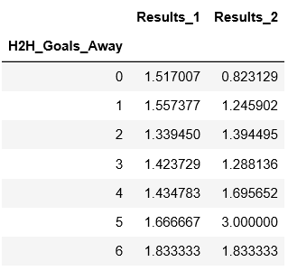

# Predicting Soccer Match Results
- Created a program that estimates the exact result of a soccer match, using the data from previous matches and some factors that might influence the game, with Supervised Learning and estimate the overall result of the match. 
- Optimized the best model with Linear, Lasso, and Random Forest Regressors using GridsearchCV. 
- Using the 2013 Premier League season, separated between train and test, the accuracy of the exact result was of 45% and the overall result of the match (win/draw/loss) was 95%.

Code and Resources
-
- Python: 3.7
- Packages: numpy, sklearn, matplotlib, seabor, pickle
- Data source: https://www.kaggle.com/analystmasters/world-soccer-live-data-feed?select=analystm_mode_1_v1.csv
- Ken Jee Data Science Project from Scratch, guidance of step-by-step of the complete Data Science project: https://www.youtube.com/watch?v=MpF9HENQjDo&t=307s

Data Selection
-
Manipulated the csv file from Kaggle to get the following columns to use for the model building:
- Home Team Goals at Match
- Away Team Goals at Match
- League Rank Home Team
- League Rank Away Team
- Goals Scored Home Team in Season
- Goals Scored Away Team in Season
- Goals Received Home Team in Season
- Goals Received Away Team in Season
- Goals Difference Home Team in Season
- Goals Difference Away Team in Season
- Previous Encounter Information

Data Cleaning
- 
After selecting the specific columns, I decided to make these changes to the data:
- Separated the data by league (Premier, Calcio, Bundesliga, La Liga, La Ligue)
- Separated the Previous Encounter Information into smaller pieces, keeping only the information about the last match
- Added the columns for the previous match information, goals by each side 
- Removed unnecessary data (betting odds)

EDA
-
I decided to take a deep look on how the most reknown variables affect the result for each team. I made pivot tables that showed some relationship as well as correlation map. Below are a few examples

Model Building
-
First, I created a variable with the data for both Home Team and Away Team, removing the result of the other (for the Home Team added all the columns and deleted the Result_2 column). Then, I transformed the categorical variables into dummy variables. The, proceeded to split the data into train and test sets with a train size of 80%.

I used three models and evaluated them using the Mean Squared Error, to remove the sentitivity to the outliers (star players in the bench, red cards, etc.). The three models used were:
- Multiple Linear Rgression: standard
- Lasso Regression: To use a more normalized model for all the different variables
- Random Forest: To handle the sparse data used

Model Performance
-
**Home Team**

MSE
- Linear: 0.63
- Lasso: 0.65
- Random Forest: 0.51

R-squared
- Linear: 0.61
- Lasso: 0.60
- Random Forest: 0.68

**Away Team**

MSE
- Linear: 0.63
- Lasso: 0.61
- Random Forest: 0.48

R-squared
- Linear: 0.42
- Lasso: 0.43
- Random Forest: 0.55

Testing Results
-
After building the model, I decided to test the model with the data I have. I created a new file to test and compare the predicted result using my model with the actual results, counting the number of correct predictions and getting the accuracy of the model. Also, I subtracted the predicted Home Goals and the Away Goals to see the precision of the overall match result and see how the model predicts this. After doing this small program, the results were:
- Home Team Goal Accuracy: 46%
- Away Team Goal Accuracy: 44%
- Match Overall Result: 95%

Results Analysis
-
Coming soon on my Medium
